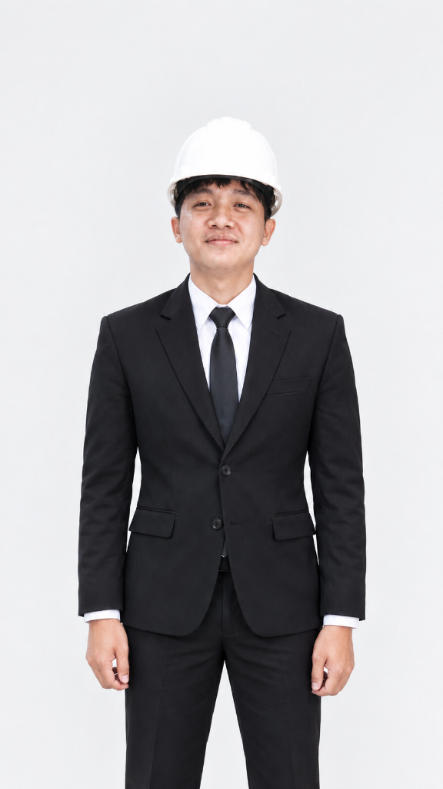

# Hi there, I'm Agung Aksa 👋

  

[)](https://git.io/typing-svg)

  <b>Passionate Junior Full-Stack Developer dedicated to building scalable web applications and enterprise internal tools that solve real-world problems.</b>

---

### 🚀 About Me

- 🎓 Graduated with honors in **Diploma III Manajemen Informatika** from **Universitas Sriwijaya (GPA: 3.91 / 4.00)**.
- 💼 Experienced developing real-world web applications during internships at **PT Andritz** (Multinational Industrial Company) and **Bappeda Litbang Kota Palembang** (Government Agency).
- 🛠️ Deep focus on backend architecture using **PHP & Laravel Framework**, relational database design in **MySQL**, and modern frontend development with **Tailwind CSS**.
- ⚡ Also experienced with low-code enterprise automation using **Microsoft Power Apps (TMS & IMS)**.
- 📍 Based in **Palembang, Indonesia** • Open for **Full-time, Contract, On-site, or Remote** opportunities.

---

### 💻 Tech Stack & Tools

| Category | Technologies |
|:---|:---|
| **Backend & APIs** |    |
| **Databases** |   |
| **Frontend** |     |
| **Enterprise / Low-Code** |   |
| **Tools & Environment** |      |

---

### 🌟 Featured Repositories (Pinned Recommendations)

1. **[Sistem-Pendaftaran-Pelepasan-Alumni](https://github.com/agungaksa)**
   - *Final Project (Tugas Akhir) at Fasilkom UNSRI.*
   - Automated graduation verification system with multi-level approvals, document generation, and analytics built with **Laravel, MySQL, and Tailwind CSS**.

2. **[Box-Locator-Web-App](https://github.com/agungaksa)**
   - *Industrial Web Application developed for PT Andritz.*
   - Real-time workshop box location mapping and parts tracking system built with **PHP / Laravel, MySQL, and JavaScript**.

3. **[Forum-Pengaduan-Kinerja-OPD](https://github.com/agungaksa)**
   - *Public Sector complaint & ticketing platform developed for Bappeda Litbang Kota Palembang.*
   - Transparent digital ticketing and performance monitoring system built with **PHP, MySQL, and Tailwind CSS**.

4. **[Portofolio-Agung](https://github.com/agungaksa)**
   - *Modern, high-performance responsive personal portfolio website.*
   - Featuring dark/light modes, project case study modals, real-time filtering, and clean design system.

---

### 📊 GitHub Activity & Stats

  
  

---

  
⭐ <i>"Committed to writing maintainable code, designing robust databases, and continuous learning."</i> ⭐

  
Feel free to reach out via <b><a href="mailto:agung.aksa10@gmail.com">Email</a></b> or <b><a href="https://wa.me/6281271959206">WhatsApp</a></b> for opportunities or collaborations!

